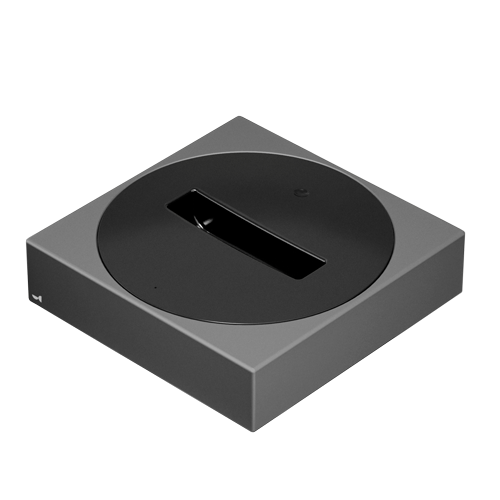

# Unfolded Circle Dock 3 Firmware

[](LICENSE)

This repository contains the firmware of the Unfolded Circle Dock 3 (UCD3), which is shipped with the [Unfolded Circle Remote 3](https://www.unfoldedcircle.com).



The dock features an Espressif ESP32-S3 MCU module with WiFi and Ethernet connectivity, internal infrared blasters and learning, and supports two external ports for IR extenders or RS232 communication.

The dock can be controlled with the [WebSocket Dock API](https://github.com/unfoldedcircle/core-api/tree/main/dock-api).

## Build

This project uses [Git submodules](https://git-scm.com/book/en/v2/Git-Tools-Submodules).

After cloning the repository or to checkout latest version:

```shell
git submodule update --init --recursive
```

❗️ Delete the `sdkconfig` file after checkout to make sure the latest default settings are applied.

The `sdkconfig` file is automatically generated during build and overlayed with the `sdkconfig.defaults` file(s).

❗️ The private signing key is required in `ucd3_firmware_signing_key.pem` in the root directory.

Either create a personal development signing key:
```shell
espsecure.py generate_signing_key --version 2 --scheme rsa3072 ucd3_firmware_signing_key.pem
```

Or disable image signing: remove all `CONFIG_SECURE_*` options in `sdkconfig.defaults`.  
See [doc/ota.md](doc/ota.md) for more information.

Build:
```shell
IDF_TARGET=esp32s3 idf.py build
```

## Update Firmware

‼️ Attention:
- Warranty is void if the dock is opened or a custom firmware is flashed with UART!
- Unsigned development firmware cannot be flashed to a production device using OTA!
- Signed production firmware can only be replaced by development firmware with UART flashing!
- The USB-C port provides UART flashing functionality.

### Upload with UART

```shell
esptool.py --chip esp32s3 --port "$SERIAL_DEV" --baud 921600 \
  --before default_reset --after hard_reset write_flash \
  --flash_mode dio --flash_freq 80m --flash_size keep \
  0x0 bootloader.bin \
  0x8000 partition-table.bin \
  0x8d000 ota_data_initial.bin \
  0x90000 ucd3-firmware.bin
```

### OTA with POST request

The OTA update requires the same authentication token used with the WebSocket Dock-API. If no custom password has been set during dock setup, `0000` must be used.

```shell
curl  --user "admin:$TOKEN" --data-binary "@./build/ucd3-firmware.bin" http://${DOCK_IP}/update
```

## Recent changes

The major changes found in each new release are listed in the [CHANGELOG](./CHANGELOG.md) and
under the GitHub [releases](https://github.com/unfoldedcircle/ucd3-firmware/releases).

## Contributions

Please read our [contribution guidelines](./CONTRIBUTING.md) before opening a pull request.

## License

This project is licensed under the [**GNU General Public License v3.0**](https://choosealicense.com/licenses/gpl-3.0/).
See the [LICENSE](LICENSE) file for details.
