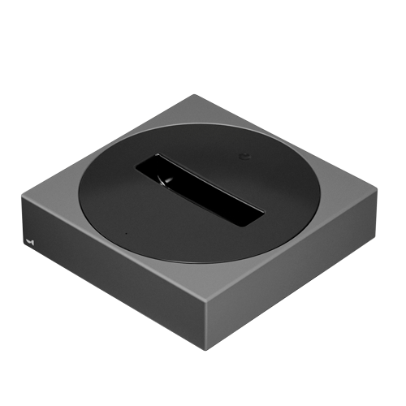
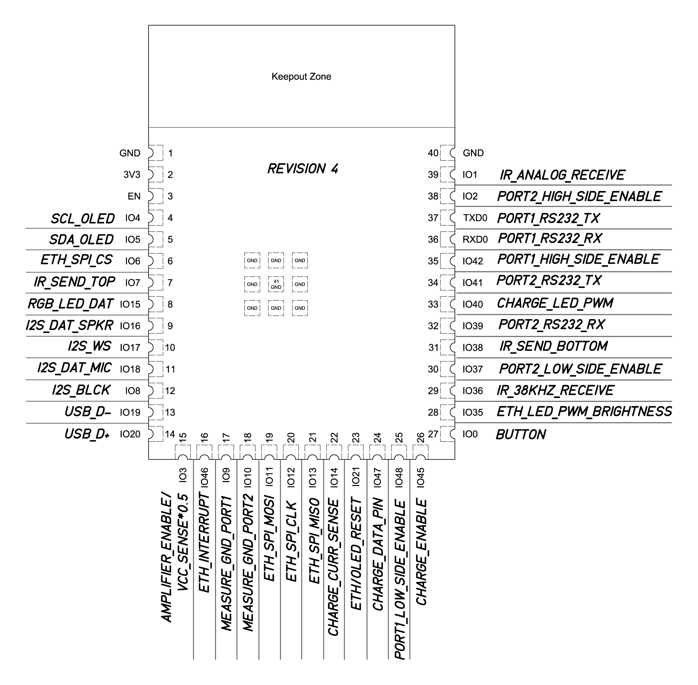

# Unfolded Circle Dock 3 Firmware

[](LICENSE)

This repository contains the firmware of the Unfolded Circle Dock 3 (UCD3), which is shipped with the [Unfolded Circle Remote 3](https://www.unfoldedcircle.com).



The dock features an Espressif ESP32-S3 MCU module with WiFi and Ethernet connectivity, internal infrared blasters and learning, and supports two external ports for IR extenders or RS232 communication.

The dock can be controlled with the [WebSocket Dock API](https://github.com/unfoldedcircle/core-api/tree/main/dock-api).

## Build

This project uses [Git submodules](https://git-scm.com/book/en/v2/Git-Tools-Submodules).

After cloning the repository or to checkout latest version:

```shell
git submodule update --init --recursive
```

❗️ Delete the `sdkconfig` file after checkout to make sure the latest default settings are applied.

The `sdkconfig` file is automatically generated during build and overlayed with the `sdkconfig.defaults` file(s).

❗️ The private signing key is required in `ucd3_firmware_signing_key.pem` in the root directory.

Either create a personal development signing key:
```shell
espsecure.py generate_signing_key --version 2 --scheme rsa3072 ucd3_firmware_signing_key.pem
```

Or disable image signing: remove all `CONFIG_SECURE_*` options in `sdkconfig.defaults`.  
See [doc/ota.md](doc/ota.md) for more information.

Build:
```shell
IDF_TARGET=esp32s3 idf.py build
```

## Update Firmware

‼️ Attention:
- Warranty is void if the dock is opened or a custom firmware is flashed with UART!
- Unsigned development firmware cannot be flashed to a production device using OTA!
- Signed production firmware can only be replaced by development firmware with UART flashing!
- The USB-C port provides UART flashing functionality.

Flashing the full firmware:

- [Manually Flashing the Dock 3 with Web Serial](doc/flash-web-serial.md).
- [Manually Flashing the Dock 3 with esptool](doc/flash-esptool.md).
 
### OTA with POST request

The OTA update requires the same authentication token used with the WebSocket Dock-API. If no custom password has been set during dock setup, `0000` must be used.

```shell
curl  --user "admin:$TOKEN" --data-binary "@./build/ucd3-firmware.bin" http://${DOCK_IP}/update
```
## Pinout



Pins defined in:
`/components/preferences/board.h`
`/components/preferences/board_r4.h`


| GPIO | ADC (S3) | Function / Label | Source Code Macro |
| :--- | :--- | :--- | :--- |
| **IO0** | - | BUTTON | `BUTTON_PIN` |
| **IO1** | ADC1_CH0 | IR_ANALOG_RECEIVE | `IR_RECEIVE_ANALOG` |
| **IO2** | - | PORT2_HIGH_SIDE_ENABLE | `SWITCH_EXT_2` |
| **IO3** | ADC1_CH2 | AMPLIFIER_ENABLE / VCC_SENSE*0.5 | `SPEAKER_GPIO` |
| **IO4** | - | SCL_OLED | `SCL` |
| **IO5** | - | SDA_OLED | `SDA` |
| **IO6** | - | ETH_SPI_CS | `SPI_CS` |
| **IO7** | - | IR_SEND_TOP | `IR_SEND_PIN_INT_TOP` |
| **IO8** | - | I2S_BLCK | `I2S_BCLK` |
| **IO9** | ADC1_CH8 | MEASURE_GND_PORT1 | `MEASURE_GND_1` |
| **IO10** | ADC1_CH9 | MEASURE_GND_PORT2 | `MEASURE_GND_2` |
| **IO11** | - | ETH_SPI_MOSI | `SPI_MOSI` |
| **IO12** | - | ETH_SPI_CLK | `SPI_CLK` |
| **IO13** | - | ETH_SPI_MISO | `SPI_MISO` |
| **IO14** | ADC2_CH3 | CHARGE_CURR_SENSE | `CHARGING_CURRENT` |
| **IO15** | - | RGB_LED_DAT | `RGB_LED` |
| **IO16** | - | I2S_DAT_SPKR | `I2S_SPEAKER_DATA` |
| **IO17** | - | I2S_WS | `I2S_WS` |
| **IO18** | - | I2S_DAT_MIC | `I2S_MIC_DATA` |
| **IO19** | - | USB_D- | `USB_D_MINUS` |
| **IO20** | - | USB_D+ | `USB_D_PLUS` |
| **IO21** | - | ETH/OLED_RESET | `PERIPHERAL_RESET` |
| **IO35** | - | ETH_LED_PWM_BRIGHTNESS | `ETH_LED_PWM` |
| **IO36** | - | IR_38KHZ_RECEIVE | `IR_RECEIVE_PIN` |
| **IO37** | - | PORT2_LOW_SIDE_ENABLE | `SWITCH_GND_2` |
| **IO38** | - | IR_SEND_BOTTOM | `IR_SEND_PIN_INT_SIDE` |
| **IO39** | - | PORT2_RS232_RX | `RX1` |
| **IO40** | - | CHARGE_LED_PWM | `CHARGE_LED_PWM` |
| **IO41** | - | PORT2_RS232_TX | `TX1` |
| **IO42** | - | PORT1_HIGH_SIDE_ENABLE | `SWITCH_EXT_1` |
| **IO45** | - | CHARGE_ENABLE | `CHARGING_ENABLE` |
| **IO46** | - | ETH_INTERRUPT | `SPI_INT` |
| **IO47** | - | CHARGE_DATA_PIN | `ROCKCHIP_PIN` |
| **IO48** | - | PORT1_LOW_SIDE_ENABLE | `SWITCH_GND_1` |
| **RXD0** | - | PORT1_RS232_RX | `RX0` (IO44) |
| **TXD0** | - | PORT1_RS232_TX | `TX0` (IO43) |

## Recent changes

The major changes found in each new release are listed in the [CHANGELOG](./CHANGELOG.md) and
under the GitHub [releases](https://github.com/unfoldedcircle/ucd3-firmware/releases).

## Contributions

Please read our [contribution guidelines](./CONTRIBUTING.md) before opening a pull request.

## License

This project is licensed under the [**GNU General Public License v3.0**](https://choosealicense.com/licenses/gpl-3.0/).
See the [LICENSE](LICENSE) file for details.
