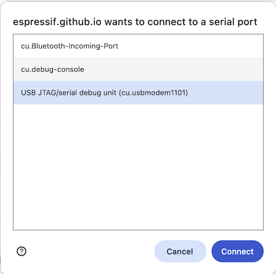
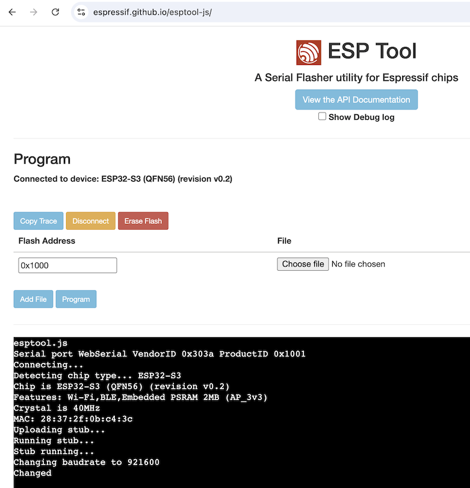
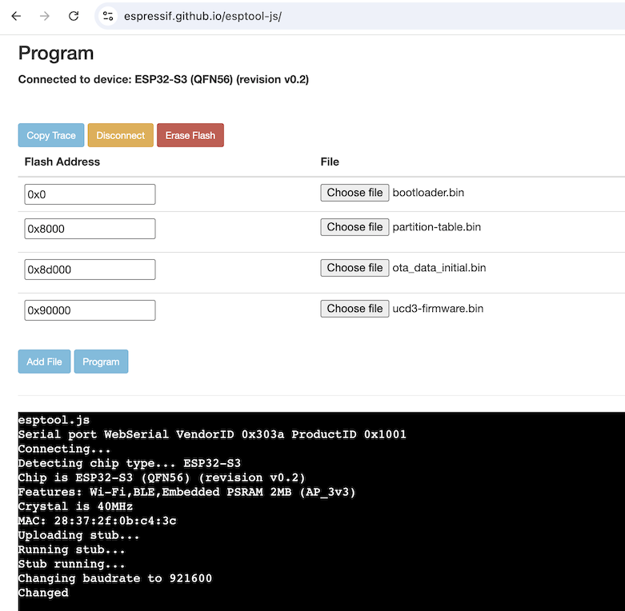
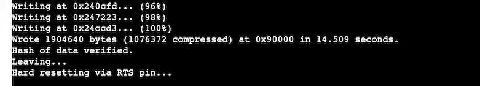

# Manually Flashing the Dock 3 with Web Serial

This article describes how a Dock 3 can be manually flashed with an official firmware from Unfolded Circle from a PC using a Chrome, Edge or Opera web browser. See [Web Serial browser compatibility](https://developer.mozilla.org/en-US/docs/Web/API/Web_Serial_API#browser_compatibility) for more information.  
The dock can also be flashed in the command line if your browser is not supported. See [Manually Flashing the Dock 3 with esptool](flash-esptool.md) for more information.

Please note that manual flashing is usually not required, except if a custom firmware like ESP Home was used and one would like to restore the original software.

1. Connect the Dock 3 with a USB cable to your PC
   > Please make sure that you only connect one dock to your PC and no other gadgets besides mouse and keyboard to avoid flashing a different device.
2. Download the Dock 3 firmware release file from [https://github.com/unfoldedcircle/ucd3-firmware/releases](https://github.com/unfoldedcircle/ucd3-firmware/releases)
    1. Choose a release, usually the latest version
    1. Download the attached firmware file under assets: UCD3-firmware_r4-v\<VERSION>.tar.gz
3. Extract the downloaded archive
4. Open the web-based serial flasher from Espressif: [https://espressif.github.io/esptool-js/](https://espressif.github.io/esptool-js/)
    
    ‼️ **Only newer version of Chrome, Edge and Opera are supported!**
    
5. Click “Connect”  and choose the Dock 3 device. It should be listed as “USB JTAG/serial debug unit”. If you are unsure, unplug and replug the dock while the dialog box is open. The device should disappear and appear again once plugged in.

    

6. If the port cannot be opened - for example if the following error is printed
”Connecting...Error: Failed to execute 'setSignals' on 'SerialPort': Failed to set control signals.” - try the following:
    1. Manually reload the web page
    2. Disconnect and reconnect the dock
7. After successful connection, the web app shows the connected device:

    

8. Optional, but recommended: click "Erase Flash" to delete all data.
9. Add the following files at the correct flash address. Click “Choose file”, enter the flash address, then click “Add file” for the next file until the following files are loaded:
    1. `0x0`: bootloader.bin
    2. `0x8000`: partition-table.bin
    3. `0x8d000`: ota_data_initial.bin
    4. `0x90000`: ucd3-firmware.bin

    

10. Double check that the flash addresses and file names are correct, then click “Program
11. Wait until every file is flashed the log window shows:

    

12. Unplug and replug the USB cable. The dock will not automatically restart after flashing!
13. Done!
